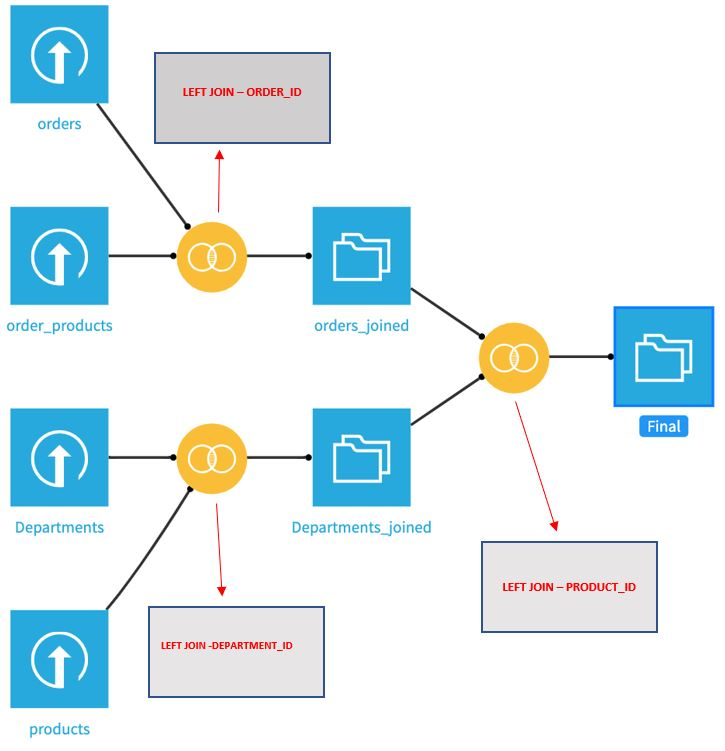
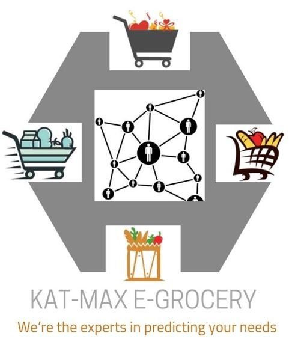

## @Author Rupesh

## Think-Tank-Case-Study

### Task 1

##### 1.) Describe the datasets and the eventual anomalies you find.
##### 2.) Which patterns do you find in the purchasing behavior of the customers?
##### 3.) What are the categories and products the customers are most interested in?
##### 4.) Split customers into different groups based on their purchasing behavior.
##### 5.) Justify your choice for your adopted method(s) and model(s).
##### 6.) Describe the defined customer groups. What are the features which are driving the differentiation amongst the different groups?
##### 7.) Optional: Give suggestions on how the business should treat these clusters differently.
##### 8.) At this point in your analysis, you are the dataset expert. Implement in your notebook any further ideas (initiatives, further analyses) you might have in mind which can be helpful for the business.

### OUR PLAN

##### * DATA UNDERSTAND & PREPROCESSING 
##### * EXPLANATORY ANALYSIS
##### * MODEL SELECTION
##### * VISUALIZATION & SHARING KEY FINDINGS
##### * RECOMMENDATION

### **1.) DATA UNDERSTAND & PREPROCESSING**

#### The case study revolves around 4 data sets consisting of:
#### **ORDERS :**
##### 1.) *Orders (Order_id, user_id, order_number, order_dow, order_hour_of_day, days_since_prior_order)*
##### 2.) *Order_Products (Order_id, product_id, add_to_cart_order)*

#### **SEGMENT & ITEAMS :**
##### 3.) *Departments (Department_id, Department)*
##### 4.) *Products (Product_id, department_id, product_name)*

##### -- **Below is a visual representation of the work flow on how the data sets are joined using primary key in Dataiku to fasten the preprocess stage in-order to increase efficiency**

  

### **OUR STORY**:

##### Kat-Max e-grocery is a renown up-and-coming new generation lifestyle brand. We have our brand presence in 10 counties and are always looking for new ways to improve and anticipate our customer needs. Covid-19 has definitely impacted the way our customers shop in our store, therefore the following are the questions we are trying to seek answers through this study in chronological order, to get deeper insights.

  

### VISUALIZATION & SHARING KEY FINDINGS

### RESULTS

  

### Task 2

You are a Lead Data Scientist in the team and this task requires you to come up with an idea for a digitalization project, based on the conditions and situation provided to you below:

The problem at hand: Due to the global pandemic, our supply chain experiences drastic shortages of various components and parts for the assembly line. For example, we need 50 parts of category A, 242 parts of category B, and 72 parts of category C to produce our target product. But only between 15 and 25 parts of each category can be delivered in time. Now, we cannot finish our production and we are losing money with each day delay. Your idea should evolve around the usage of big data and data science within the supply chain.You have access to all the global supply chain data of BMW you can think of. Be creative but also realistic.

### RESULTS

